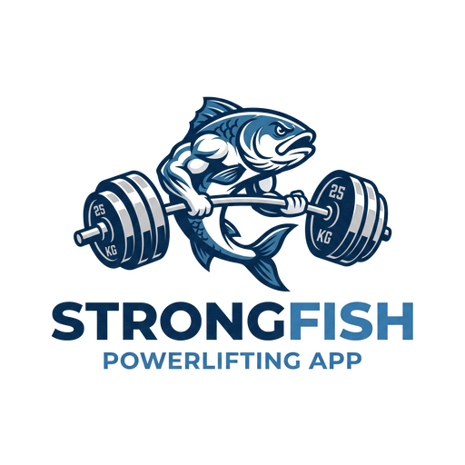

# strong-fish



A powerlifting app: RPE-based programs whose loads are computed from each
athlete's own current 1RM, clubs to coach them in, and a training feed.

## Features

* **Programs, written or imported.** A coach builds a block session by session
  in the web or mobile app, or uploads the `.xlsx` they already write it in and
  gets the same thing (see [Importing a program](#importing-a-program)).
* **Loads that follow the athlete.** Nothing derived is ever stored: every set's
  weight is computed from the member's own current max at read time, so updating
  one 1RM recalculates the whole program (see [Load calculation](#load-calculation)).
* **RPE feedback.** On each set the member logs the RPE they actually felt, the
  weight they used and a comment for their coach, and gets the estimated 1RM
  that performance demonstrates.
* **Clubs.** A coach owns the clubs they create, promotes members to admin, and
  assigns programs. Coaches read their club's feedback in one inbox.
* **A shared exercise catalog.** A coach adds "larsen press" once and every other
  coach gets it in their autocomplete, with English and French labels. A
  superadmin curates it: editing and deleting entries, and flagging which ones
  are competition movements (see [Exercise administration](#exercise-administration)).
* **Profiles you control.** Three visibility levels - everyone, your clubs, or
  your coaches only - applied everywhere a profile can be reached, including the
  search (see [Profile visibility](#profile-visibility)). An optional birthdate
  becomes a calendar entry for your club-mates.
* **Finding people.** Search by name, surname or email, returning only the
  profiles their owners let you see.
* **Club invitations.** A coach invites anybody by email; the invitation waits
  in the app - and survives the invitee not having an account yet (see
  [Club invitations](#club-invitations)).
* **Public profiles and a feed.** Follow, post, like, comment and report;
  posts are public or club-only, carry inline pictures, and embed the first URL
  in their text with a player - no separate link field to keep in step. Videos
  can be uploaded to the member's own bucket (see [Video uploads](#video-uploads)).
* **A calendar.** Meets, club sessions and camps, subscribable from Outlook or
  Google Calendar (see [The calendar](#the-calendar)).
* **Authentication.** Anyone can sign up - as an athlete, or as a coach, which
  a superadmin has to confirm (see [Coach confirmation](#coach-confirmation)). MFA with TOTP authenticator apps and
  WebAuthn security keys (YubiKey and friends). Optional OIDC login with Google,
  GitHub and Keycloak. **API keys** for scripts, and for signing the mobile app
  in by scanning a QR code (see [API keys](#api-keys)).
* **Shareable programs.** A program is private to its club by default; a coach
  can publish one and hand out a link that works with no account at all (see
  [Public programs](#public-programs)).
* **I18N** in English and French, across the API's error codes, the web app and
  the mobile app.
* **Light/dark mode**, following the OS by default and switchable from the
  sidebar. The logo ships in two inks so the wordmark stays legible either way.
* **An About page** you can write without touching the build - it renders
  `public/about.md` (and `about.fr.md`) at runtime.
* **A contact form**, forwarded to CWCloud's contact-request API (see
  [Contact form](#contact-form)).
* **Private messages.** Direct conversations with the members whose profile you
  can see, reportable to a moderator, plus a block list that clears somebody out
  of your feed and your inbox (see [Messages and blocks](#messages-and-blocks)).
* **Observability.** Structured logs, traces and metrics through one OTLP
  collector, and a Prometheus endpoint (see [Observability](#observability)).
* **Documentation** as its own site: [`sf-wiki`](./sf-wiki), in English and
  French, light and dark (see [The wiki](#the-wiki)).
* **In-app upgrades on Android.** The app checks for a newer build and installs
  it in place, so nobody has to sign in again.
* **A self-describing API.** The API's root serves a Swagger UI over an OpenAPI
  document generated from the live router, so it cannot drift out of step with
  the routes it documents.

## Technologies

* [Go](https://go.dev) and [PostgreSQL](https://www.postgresql.org) for the API
  ([`sf-api`](./sf-api))
* [Flyway](https://flywaydb.org) for the migrations ([`sf-db`](./sf-db))
* [React](https://react.dev) for the web app ([`sf-ui`](./sf-ui))
* [Flutter](https://flutter.dev) for the mobile app ([`sf-mobile`](./sf-mobile))

## Getting started

The whole stack (PostgreSQL, the Flyway migrations, the API and the web app
behind nginx) starts with one command:

```shell
docker compose up --build
```

Then open [`http://localhost:3000`](http://localhost:3000). **The first account
you register becomes the superadmin**; every later one is disabled until it's
activated - by the link emailed to it (`SF_ACTIVATION_MODE=email`, the default)
or by a superadmin (`SF_ACTIVATION_MODE=admin`).

The API's own root, [`http://localhost:8080`](http://localhost:8080), serves a
Swagger UI over `/openapi.json` - a document generated by walking the live chi
router at startup, so it describes the routes that are actually registered
rather than a spec file somebody has to remember to update.

Copy [`.env.example`](./.env.example) to configure a real deployment. Outgoing
email goes through CWCloud's email API, driven by `CWCLOUD_API_URL` and
`CWCLOUD_API_KEY`; with those unset, mail is logged and skipped rather than
failing a registration. Two more knobs are worth knowing:

| Variable | What it does |
| --- | --- |
| `SF_MOBILE_URL_PATTERN` | Where the Android build is published; `{version}` is substituted, and a path is resolved against `SF_UI_URL`. Blank hides the download entry rather than offering a dead link. |
| `SF_GIT_REPO_URL` | The sources link shown on the signed-out screens. |
| `SF_OTEL_ENDPOINT` | The collector traces, logs and metrics are pushed to. Blank disables export; logs and `/v1/metrics` are unaffected. |
| `SF_DOC_URL` / `SF_ABOUT_URL` | The wiki's root, and the About page inside it. Both are linked from the app rather than rendered by it. |

### Running the pieces separately

```shell
cd sf-api && go run .
cd sf-ui && npm install && npm start
cd sf-mobile && flutter run
```

## Load calculation

This is the core of the app, and the thing the reference spreadsheet
([`ai-gen/assets/program.xlsx`](./ai-gen/assets/program.xlsx)) gets wrong.

Powerlifting programs are written in RPE: "3 reps @ RPE 8" means three reps
leaving two in reserve. How much of a one-rep max that represents is read off
the standard RPE chart.

The spreadsheet doesn't compute its loads that way. Every row carries a
`Percentage` column typed in by hand from that chart, and the load is
`percentage/100 × 1RM`. Two things go wrong:

1. **The typed percentages contradict each other.** Across the five weeks, eight
   distinct (reps, RPE) pairs are given two different percentages - 5 reps @
   RPE 8 is 82% in one session and 78% in another; 3 reps @ RPE 8 is 87% in one
   and 81% in another. Whichever was meant, both can't be right.
2. **They're frozen against the author's own maxes.** A percentage doesn't follow
   the member actually running the program, and doesn't move when they get
   stronger.

[`internal/loadcalc`](./sf-api/internal/loadcalc) fixes both by reading the chart
directly against the member's own current 1RM:

```
load = 1RM × Intensity(reps, RPE)
```

which is self-consistent - a set performed as prescribed estimates back to
exactly the max it was prescribed from, where the spreadsheet's own `e1RM` column
drifts by up to 3kg - and recomputes for free whenever the member updates a max,
since no derived weight is ever stored.

Three other prescription kinds are supported, because the source file uses all of
them: a fixed **percentage** of the member's 1RM (for sets the coach deliberately
left without an RPE - the spreadsheet writes those as `?`), an **absolute** weight
for accessories, and **bodyweight** movements like pull-ups and dips.

Loads are also reported snapped to a loadable increment (`SF_PLATE_INCREMENT`,
2.5kg by default - one small plate per side).

## Building a program

A program is a set of sessions, each a list of prescribed sets. It's created
either way round:

* **From the app.** Create an empty program, add sessions, and add sets to them.
  A session added without week/day numbers continues the program's own numbering,
  so filling a block is a matter of pressing "add session" repeatedly. Each set
  states how it's loaded - reps at an RPE, a percentage of the 1RM, a fixed
  weight, or bodyweight - and only the field that mode uses is asked for.
* **From a spreadsheet.** See below.

The week count is never stored: it's derived from the sessions, so a program
built one session at a time can't drift out of step with a declared total.

## Exercise administration

The catalog is shared by every club, which is what makes a movement nameable
once. That sharing is also why it's curated:

* **Any coach can add** a movement - a program can't be written without naming
  what it prescribes, and the importer adds whatever a spreadsheet mentions.
* **Only a superadmin can edit or delete** one: a rename ripples through
  everyone's programs, and a delete cascades into their sets.
* **Only a superadmin can flag a competition movement.** That flag decides which
  1RMs every member is prompted to record, and which max a derived movement's
  percentage or RPE prescription resolves against - an instance-wide decision,
  not a per-coach one.

Deleting is a real cascade, so the app asks the API what it would take with it
(`GET /v1/exercises/{id}/usage` - prescribed sets, the programs they're in, and
recorded 1RMs) and shows those numbers in the confirmation before carrying it
out.

## Importing a program

`POST /v1/clubs/{clubId}/programs/import` takes the coach's `.xlsx`. Two layouts
are read, told apart by their header rows rather than by the file name, so both
go through the same upload button:

**One sheet per week** ([`program_1.xlsx`](./ai-gen/assets/program_1.xlsx)) - a
`refs` sheet holding the 1RMs the percentages were authored against, and each
training day starting with an
`Exercice | Reps | RPE | Percentage | Load | e1RM | Part` header row.

**One sheet per block** ([`program_2.xlsx`](./ai-gen/assets/program_2.xlsx)) -
one sheet holds a whole block of several weeks, under an
`EXERCICES | SÉRIES/REPS | RPE | ESTIMATIONS | REMARQUES` header followed by a
`W1..Wn` column per week. Sessions are marked `SÉANCE n` in the first column, and
a `3 x 8` cell expands to three prescribed sets of eight; a row with only a
sets/reps value continues the movement above it (its top single's back-off work),
inheriting that row's RPE when the cell is left blank.

Blocks are consecutive, so a workbook of two four-week sheets is an eight-week
program - the second sheet's `W1` is program week 5. The coach writes each
session once and it runs every week of the block, which is what the `W*` columns
are for: they are one athlete's log, not the program. **They are deliberately not
imported.** A program here is generic - handed to every member of a club, or
published to anyone - so importing one person's numbers as everybody's
prescription would be wrong, and the app collects that feedback itself.

Neither layout reads the weights the workbook computes for itself. Every load in
this app is derived from the member reading it (see *Load calculation* above), so
a spreadsheet whose formulas are stale, broken, or written against somebody
else's maxes imports exactly as well as a correct one.

The importer is deliberately tolerant, because real files aren't clean - in the
week-per-sheet reference file four day-title cells were clobbered by a stray fill-down formula
and evaluate to an exercise name or a bare number. A day is therefore recognized
by its header row rather than its title, and week/day numbering falls back to the
sheet name plus the block's position. Anything it had to guess at comes back in
the response's `warnings` so the coach sees it.

It also recovers what the file never states outright: which competition lift each
movement is programmed off. A Larsen press row just computes "82% of `refs!B4`",
so the reference lift is inferred from the arithmetic - the row's cached load and
percentage imply the max the author used, and that lands on one of the reference
1RMs.

Every movement is matched against the catalog by its normalized name or one of
its aliases, so a spreadsheet spelling one differently (or with the reference
file's "Dumbbel" typo) lands on the existing entry. Anything genuinely new is
added to the catalog, and reported back in the response so the coach can see what
was created.

## Repository layout

| Path | What's in it |
| --- | --- |
| [`sf-db`](./sf-db) | Flyway migrations: the schema, and the exercise catalog seeded from the reference program |
| [`sf-api`](./sf-api) | The Go API |
| [`sf-ui`](./sf-ui) | The React web app |
| [`sf-mobile`](./sf-mobile) | The Flutter mobile app |
| [`sf-wiki`](./sf-wiki) | The documentation site (Docusaurus, English and French) |
| [`ai-gen`](./ai-gen) | The instructions and assets this was built from |

Every table is a thin set of indexed, foreign-keyed columns plus a single `data`
JSONB payload, so the schema stays stable while the domain grows.

## Tests

```shell
cd sf-api && go test ./...
cd sf-ui && CI=true npm run build
cd sf-mobile && flutter analyze
cd sf-wiki && npm run build
```

The API's tests cover the load calculation against the reference spreadsheet's
own numbers, the spreadsheet importer against both real files, the profile
visibility rules (every widening there is a privacy regression nothing else
would catch), the ICS generator, and the router (a
subrouter silently shadowing a route is not a startup error in chi, so every
endpoint is asserted to resolve).

## Design

The look is ported from [cwclock](https://gitlab.cwcloud.tech/oss/cwclock): the
same token structure (`sf-ui/src/index.css` mirrors its `--cw-*` scales), the
same three-way theming - the OS preference by default, an explicit `[data-theme]`
choice winning in either direction - the same modal/card/button shapes, the same
`react-toastify` behaviour, and `react-icons` throughout. `sf-mobile/lib/theme.dart`
carries the same tokens as a Flutter `ThemeExtension`, so the two clients read as
one product.

The brand hues come from the logo: a deep navy for chrome and a steel blue for
action. The logo itself ships in two inks - the stock navy one would all but
disappear on a dark background, so dark mode gets a light-inked variant, and the
favicon follows `prefers-color-scheme` the same way. The sidebar shows the mark
alone, at size: the logo already carries the name, so repeating it as text
beside it only crowds the rail.

The rail is collapsible, and collapsed it is icons only - each naming itself
through a tooltip on hover or keyboard focus, the way cwclock's does. The
preference is remembered, because somebody who wants the room back wants it on
every screen. In dark mode the chrome drops its navy and takes the page's own
background, separated by a hairline instead: the point of a dark theme is one
ground, and a navy plate behind the logo reads as a mistake rather than as
branding.

Dropdowns follow [uprodit](https://uprodit.com)'s language picker: a pill toggle
carrying an icon, a short code and a caret, opening a popup list whose rows show
a code chip, the full label and a check on the current one. It's a real listbox
rather than a styled `<select>`, because a native one can't take that layout -
and because the sidebar's dropdowns sit on the navy chrome, where a browser's
own select styling looks out of place.

The signed-out screens are split: a photograph of a deadlift at an IPF European
Championships fills the left, the form sits on the right. Below 900px the photo
is dropped rather than letterboxed above the form - a thin strip of image earns
nothing on a phone - and the form takes the navy gradient as its own background.

That photograph is CC BY-SA 4.0, so the screen carries a real attribution
linking the author and the licence. The ShareAlike term attaches to the image
and to adaptations of it, **not** to the software that displays it - the project's
own code stays MIT. See [`sf-ui/public/CREDITS.md`](./sf-ui/public/CREDITS.md)
for the full provenance and what swapping the file would change.

## The wiki

The documentation lives in [`sf-wiki`](./sf-wiki) as a Docusaurus site and is
published at `doc.strong-fish.com`. English and French are both full
translations - a page missing from `i18n/fr/` renders in English rather than
404ing - and it follows the reader's own light/dark preference.

The **About page moved there**. It was `sf-ui/public/about.md`, rendered at
runtime by the app; it is now `sf-wiki/docs/about.md`, and the app links out.
Long-form prose that changes on its own schedule does not want a second copy in
the frontend, and `SF_ABOUT_URL` (with `SF_DOC_URL` for the wiki's root) is what
lets a deployment point at its own.

Both URLs are reported by `GET /v1/config` rather than compiled into the
frontend, so a deployment can repoint them without rebuilding.

The tutorial **screenshots are of the real app**, captured against a mock API
serving fake data - the screens are genuine, the accounts in them are not.

It builds and deploys from the same pipeline as everything else: a `wiki` stage
in the root `Dockerfile`, a `wiki` service in `docker-compose-build.yml`, and
`sf-wiki/**/*` in the pipeline's change rules.

## Contact form

`POST /v1/contact` forwards a submission to CWCloud's contact-request API
(`POST {CWCLOUD_API_URL}/v1/contactreq`) - the same integration cwclock uses.
Unlike the email API it needs no key: `CWCLOUD_CONTACT_FORM_ID` is the form's
uuid, and that is what scopes the submission on CWCloud's side.

The page is public, because someone who cannot sign in is exactly who most
needs to reach you. The browser never talks to CWCloud directly: the API holds
the form id, and it fills in the submitter's IP from the request's own
`X-Real-IP`/`X-Forwarded-By` headers (set by the reverse proxy) rather than
from the payload - that IP is what CWCloud rate-limits on, so accepting one
from the submitter would hand them the means to sidestep the limit.

CWCloud's own rejections (`cf_rate_limiting`, `message_too_short`,
`gibberish`) are mapped onto translated messages, so a submitter is told what
to change instead of just "something went wrong".

With `CWCLOUD_CONTACT_FORM_ID` unset the endpoint answers **405** and
`GET /v1/config` reports `contactEnabled: false`, which is what makes the
frontend hide the link entirely rather than offer a page that cannot work.

## API keys

An API key authenticates a request with an `X-Api-Key` header instead of a
bearer token, carrying exactly its owner's permissions. The data model is
[cwclock](https://gitlab.cwcloud.tech/oss/cwclock)'s: `api_keys` holds the
sha256 of the token and an optional expiry, never the token itself. The
plaintext exists once, in the response to the call that minted it - which is why
the web app shows it in a modal that does not come back.

`middleware.Auth` takes either credential, and `X-Api-Key` wins when both are
sent: a client that sent a key meant to use it, and quietly authenticating it as
whoever the bearer token belongs to would be worse than a 401.

The same key is what enrols a phone. `POST /v1/users/me/config/qr` and
`/config/file` render it as

```
api_url = https://api.example.org
api_key = <token>
```

- one as a QR code, one as a downloadable file for a future CLI. The mobile app's
"sign in by scanning a QR code" reads exactly that text (a QR code is only a
container for it), checks it against the server it names, and only stores the key
once the API has accepted it. The token is POSTed to those endpoints rather than
sent as a header because a custom request header would need a CORS exception on
reverse proxies that a plain JSON body does not.

## Public programs

`programs.data.visibility` is `club` (the default, and what every program written
before sharing existed reads as) or `public`. A manager flips it from the
program's page and gets a link to `/programs/{id}`.

The unauthenticated read is `GET /v1/public/programs/{programId}`, and it is
deliberately not the authenticated handler with the membership check skipped:

* the visibility predicate lives in the store's query (`FindPublicByID`), so the
  anonymous path cannot read a private program even if a caller forgets to look
  at the flag;
* a private program is reported as **404**, not 403 - the difference would
  confirm the id exists to somebody guessing;
* there is no member to resolve loads against, so a visitor sees the prescription
  as written - reps, effort and the coach's notes - with no weights, no 1RMs and
  nobody's logs. What was actually lifted stays inside the club.

Turning sharing back off breaks the link immediately; nothing about it is
cached or signed.

## Profile visibility

A profile is readable at one of three levels, and the rule is one function -
`models.CanSeeProfile` - applied by the profile endpoint, the profile's posts,
and the search:

| Level | Who can read it |
| --- | --- |
| `public` | Anybody, signed in or not. This is what makes a shared profile link work. |
| `clubs` | Members of the clubs its owner belongs to. |
| `private` | A superadmin, and the owner or admin of a club its owner belongs to - their coach. |

The owner always sees themselves and a superadmin always sees everything, at
every level. A value the app doesn't recognize - including the empty string an
account written before this existed carries - normalizes to `private`: an
unknown level must never widen an audience, and there is a test that says so.

Two consequences worth stating plainly:

* **`clubs` cannot be evaluated for a logged-out visitor.** Knowing whether
  somebody shares a club with the owner requires knowing who they are, so an
  anonymous reader is refused. Only `public` is genuinely readable without
  authentication.
* **A hidden profile answers 404, not 403.** The difference would confirm that a
  handle exists to somebody guessing them.

The V5 migration maps the old `publicProfile` boolean exactly - `true` became
`public`, `false` became `private` - and moves nobody into `clubs`. Widening an
audience is not a migration's decision to make.

The **search** (`GET /v1/search/members`) takes `terms`, `name`, `surname` and
`email`, combined with AND, the way uprodit's own search composes its query
parameters. The visibility predicate lives inside the query rather than
filtering the results, for two reasons: a caller-side filter makes the page
counts wrong (a page of 20 comes back with 3), and it puts the enforcement in
whichever handler remembered it rather than in the one place every search goes
through. Disabled and banned accounts never appear.

An optional **birthdate** becomes a calendar entry, derived on read rather than
stored as a row: a birthday has no author, cannot be edited, and has to vanish
the moment its owner clears the date or narrows their profile. The audience is
deliberately narrower than "everyone who may see the profile" - it is the
owner's **club-mates**, and only those who may see the profile at all. A
birthdate is personal, and a public profile is readable by the whole internet;
filling one in should not put your date of birth into strangers' calendars. In
the ICS feed it is emitted once with `RRULE:FREQ=YEARLY` and a UID that carries
no year, so a client expands it forever instead of accumulating one entry per
January.

## Club invitations

Adding a member and inviting one are different acts, and both exist. A coach
entering their own athletes **adds** them; reaching out to somebody who has to
agree - or who has no account here yet - **invites** them.

An invitation is keyed by **email address**, not by a user id. That is most of
the point: `POST /v1/clubs/{clubId}/invitations` works for an address with no
account behind it, and `GET /v1/users/me/invitations` matches on the address at
read time, so an account created a week later still finds the invitation
waiting. It also means the invitation carries nothing anybody could guess their
way into - an id from somebody else's invitation resolves to a 404, not to a
membership.

The invitee gets an email with a link to the invitations page and sees the same
invitation in the app (web and mobile), badged in the sidebar. Accepting writes
the membership and marks the invitation accepted **in one transaction**: an
accepted invitation whose membership failed to write would leave somebody
convinced they had joined a club they are not in.

A partial unique index keeps one *pending* invitation per club and address -
inviting twice updates rather than stacking a second one to decline - while
still allowing a fresh invitation after a declined one.

## Coach confirmation

Signing up asks which of the two this is: an athlete, or a coach. Choosing
coach records a **claim, never a grant** - coaching means creating clubs and
writing other people's training - so the account is created as an ordinary
athlete with a pending request, and every superadmin is emailed.

The queue is `GET /v1/admin/coach-requests`, with the decision at
`PUT /v1/admin/coach-requests/{userId}`. Approving is what actually grants the
role, and only to an account that is already confirmed: one still waiting on its
activation link keeps waiting, and a banned one stays banned. Rejecting
**requires a motive**, because it is emailed to the applicant and "no" on its
own tells them nothing about whether to ask again.

## Connection addresses

Every address an account signs in from is recorded in its own payload with a hit
counter, a first-seen and a last-seen, and the superadmin's user list shows them -
the same view [uprodit](https://uprodit.com) offers.

There is deliberately **no ban**: blocking an address is the firewall's job, and
a second, weaker copy of that rule inside the application would only be a place
for the two to disagree. This is for recognizing an account, not for stopping
one.

It is recorded when a session is minted rather than per request - the alternative
is a database write on every single call for a number nobody reads that often -
and it is best-effort: losing a counter tick must never fail a login. The list
is capped (`models.MaxConnectionIPs`), because an account connecting from a new
address every time would otherwise grow its own row without limit.

## Messages and blocks

A conversation is addressed by **who is in it**, not by an id: there is exactly
one thread per pair of members, so `GET /v1/messages/with/{userId}` opens it and
creates it on first use. Making a client look an id up first would only add a
round trip and a way to get it wrong.

Who may write to whom reuses the profile rules rather than adding a second
setting: **you can message somebody whose profile you can see.** The visibility
a member chose is already a statement about their reach, and asking the same
question twice would only let the two answers disagree. It is re-checked on
every send, not only when the thread was opened - somebody may have narrowed
their profile, or blocked the sender, in between.

**Blocking** is stored directionally - who blocked whom - and enforced in both:
the blocker stops seeing the blocked member's posts, the blocked member stops
seeing theirs, and neither can message the other. What stays one-directional is
who may lift it. The feed queries carry the exclusion in SQL (`notBlockedClause`)
rather than filtering their results, for the same reason the visibility rules
do: a caller-side filter makes the page counts wrong, and it only applies where
somebody remembered it.

Being blocked is never reported as such - the API answers "you cannot message
this member". That somebody blocked you is information they did not agree to
share.

A message can be **reported**. Unlike a post, a moderator cannot go and look at
it in context, so the report carries the message's text as its snapshot, and
only a participant in the thread may file one.

## Observability

Ported from [cwclock](https://gitlab.cwcloud.tech/oss/cwclock): logs, traces and
metrics through one collector, configured by `SF_OTEL_ENDPOINT` and
`SF_OTEL_PROTO` (`otlp/grpc` by default, `otlp/http` to opt out).

* **Logs** always go to stdout/stderr, whether or not export is configured - a
  container's logs are the one thing that has to work when the collector is what
  is down. When an endpoint is set the same records are additionally exported
  over OTLP.
* **Traces**: one span per request.
* **Metrics**: `GET /v1/metrics` serves Prometheus, and the same instruments are
  pushed over OTLP when an endpoint is configured. Alongside the Go and process
  collectors there are request counts and durations, and gauges for accounts per
  role, clubs and programs.

The span, the access log line and the metric all use the **resolved chi route
pattern**, not the raw path. The span has to be opened before the handler chain
runs, when the pattern isn't known yet, so it starts named after the path and is
renamed once chi has matched - otherwise every request for a different program
id would be its own endpoint and none of it would aggregate.

`SF_OTEL_ENDPOINT` unset disables export and nothing else: `/v1/metrics` still
serves and the logs still land, so a local run is fully observable with no
collector at all.

## Video uploads

A picture in a post is a base64 data URI in the same JSONB row as the post. A
video cannot be: 20MB per post would wreck the column, and serving other
people's training footage is not this app's business.

So strong-fish hosts no video at all. A member who wants to post one configures
their own destination in the settings - an S3-compatible bucket or a Google
Drive folder, the same connection shape
[cwclock](https://gitlab.cwcloud.tech/oss/cwclock) uses for an organization's
external storage - and `POST /v1/media/videos` writes there and returns the
object's URL. The composer appends that URL to the post's text, and from there
it is an ordinary link: the same detection that turns a pasted YouTube URL into
a player turns this one into a `<video>`.

With nothing configured the endpoint answers **405** - the request is fine, the
method just isn't available on that account yet - which the client shows as
"set up your storage first" rather than as a failure.

Both providers are spoken to over their plain REST APIs, with no cloud SDK as a
dependency: an S3 request is hand-signed with SigV4 (path-style, so a
self-hosted MinIO with no per-bucket DNS works), and a Drive one authenticates
with a service-account JWT. Each is responsible for making its object readable
as it writes it - `x-amz-acl: public-read` on S3, an anyone-with-the-link
reader permission on Drive - because the URL has to work for a browser with no
credentials.

The Drive key is **uploaded as the JSON file Google hands out**, not pasted as
base64: the encoding is a storage detail, and making somebody run `base64` in a
terminal first is a step that exists only because of it. The stored value is
base64 either way.

Credentials are write-only. `GET /v1/users/me/storage` returns the connection
with the secret replaced by a marker; echoing that marker back on save keeps
the stored secret, which is what lets somebody change their bucket name without
retyping a key they can no longer read.

`SF_MAX_VIDEO_SIZE` caps one upload (20MB by default).

## The calendar

`events` holds competitions, club sessions and camps. An event either belongs
to a club - and then only its managers may write it - or belongs to none, which
is the open calendar a superadmin curates. Reading follows the same visibility
rule posts do, so a club can keep its own dates to itself while still
publishing the meets it wants seen, and `GET /v1/events` is readable logged out
(a meet anybody can enter is exactly what is worth finding before you have an
account).

Times are stored as RFC 3339 instants normalized to UTC, not as the floating
day/time a training session uses: a meet starts at a stated hour in a stated
place, and somebody subscribing from another timezone still has to be there
then. Normalizing also makes the listings correct - they bound and sort by
comparing the stored text, which only matches chronological order when every
value shares an offset.

**Subscribing** is the point. `GET /v1/calendar/{token}.ics` is an RFC 5545
feed Outlook and Google Calendar poll directly. Neither can send an
`Authorization` header when polling a subscription, so the token in the URL is
the whole credential - the same trust model as any other share-by-link, which
is why it can be regenerated and why an unknown one answers 404 rather than 401
(a 401 makes a calendar client prompt its user for credentials that don't
exist).

The generator is covered by tests, because the failure modes are silent: an
all-day `DTEND` has to be the day *after* the last one or Outlook renders no
day at all, and an unescaped comma or newline in a summary doesn't merely look
wrong - it ends the content line and corrupts every property after it.

## Cookies

strong-fish only ever puts functional data in local storage - the session token,
the chosen theme and the chosen language. There are no third-party tracking or
analytics cookies, so the banner (ported from cwclock, with its wording) is a
one-time informational notice rather than an accept/reject consent flow.

## The i18n dictionaries

The web app's dictionaries are the source of truth; the mobile app's Dart
dictionaries are generated from them so a string added once works in both:

```shell
cd sf-ui && node tools/gen_dart_i18n.mjs
```
