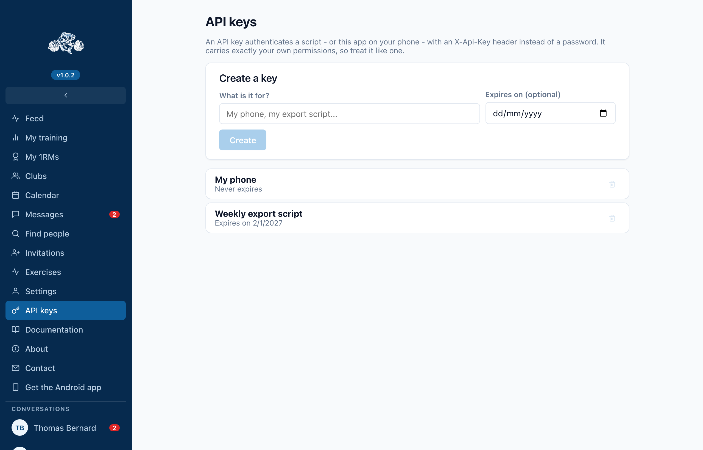

The mobile app can be signed in by **scanning a QR code** instead of typing an
email and a password on a phone keyboard. The same key also configures a script
or a future CLI.

## What an API key is

A credential that authenticates a request with an `X-Api-Key` header rather than
a session. It carries **exactly your own permissions** - no more, no less - so
treat it the way you treat your password.

The API stores only a fingerprint of it. The key itself exists once, in the
screen that creates it, and cannot be shown again afterwards. That is deliberate:
a credential a server can read back is a credential a compromised server can
hand out.

## Creating one

1. Sign in on the web app.
2. Go to **API keys** in the sidebar.
3. Describe what it is for - "my phone", "my export script". You will thank
   yourself when you have three of them.
4. Optionally set an expiry date. A key with no expiry works until you revoke it.
5. Choose **Create**.



A dialog opens with the key. **It will not come back.** From here you can:

* **Copy** it, for pasting into a script;
* **Download the config file**, a small text file a CLI reads as-is;
* **Show the QR code**, which is what the mobile app scans.


## Signing the app in

1. Install the Android app - the download link and its own QR code are in the
   sidebar under **Get the Android app**.
2. Open it. On the login screen, choose **Sign in by scanning a QR code**.
3. Allow the camera when asked.
4. Point it at the QR code on your computer.

The app reads the server address and the key out of the code, checks them
against that server, and only stores the key once the server has accepted it. A
code that scans cleanly but names a server that rejects it leaves the app
exactly as it was.

## What the code actually contains

Two lines of text - a QR code is only a container for it:

```
api_url = https://api.strong-fish.com
api_key = <your key>
```

The downloadable config file has the same contents, which is why one key
configures both the phone and a CLI.

:::warning Anybody who scans it is you
The QR code is a credential on screen. Do not project it, screenshot it into a
group chat, or leave it open on a shared machine. If one gets out, revoke that
key - **API keys → Revoke** - and it stops working everywhere immediately.
:::

## Revoking

**API keys** lists what you have, when each expires, and a revoke button. A
revoked key stops working at once, wherever it is used. Signing in with a
password on a device that was enrolled by QR code also replaces its key.
