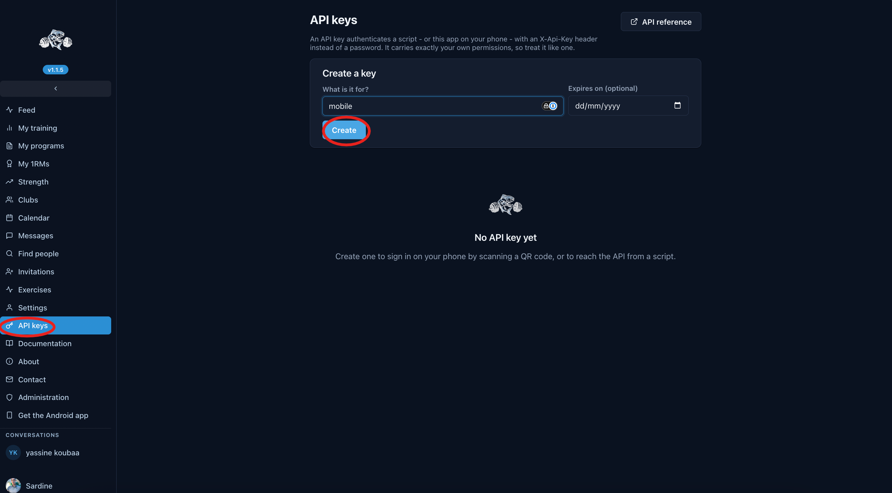
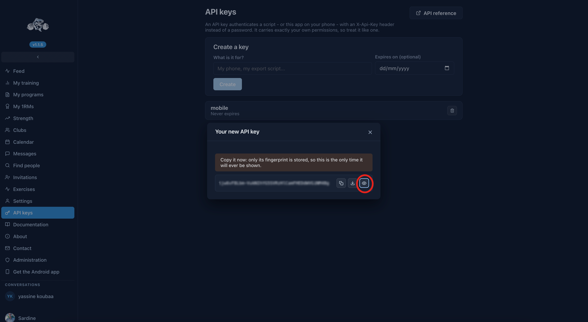
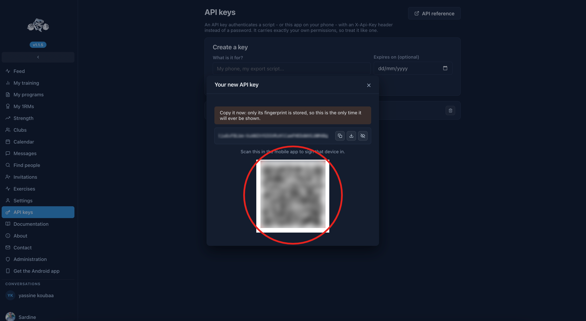
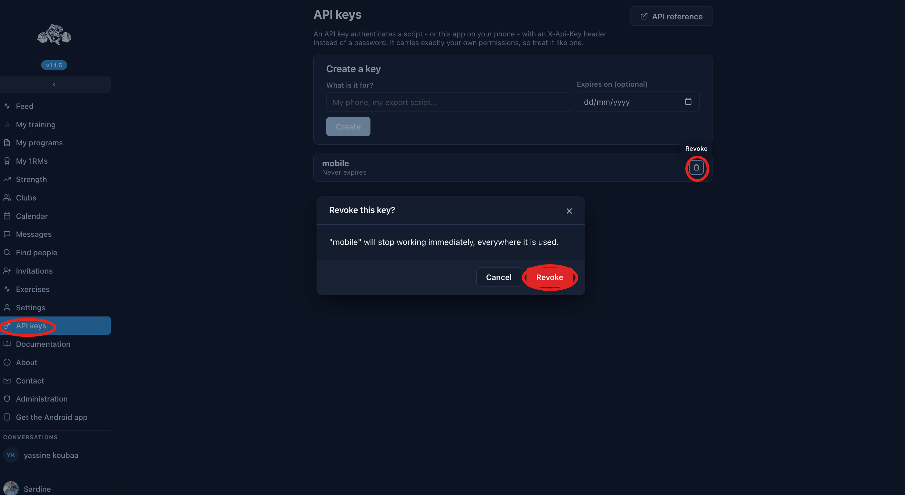

StrongFish has a REST API. Its OpenAPI specification is published [here](https://api.strong-fish.com), and requests to it are authenticated with an API key.

## API keys

### What an API key is

A credential that authenticates a request with an `X-Api-Key` header rather than a session. It carries **exactly your own permissions** - no more, no less - so treat it the way you treat your password.

The API stores only a fingerprint of it. The key itself exists once, in the screen that creates it, and cannot be shown again afterwards. That is deliberate: a credential a server can read back is a credential a compromised server can hand out.

### Creating one, and signing in with it

Go to _API keys_ in the sidebar and create one:

You can then copy the displayed value somewhere safe, to use it with the `X-Api-Key` header in your script.

Or display the QR code, with the _eye_ icon, if you need it to sign in on mobile:

Beware: once you close the dialog, **it will not come back**.

### Revoking

_API keys_ lists what you have, when each expires, and a _revoke_ button.

A revoked key stops working at once, wherever it is used.
