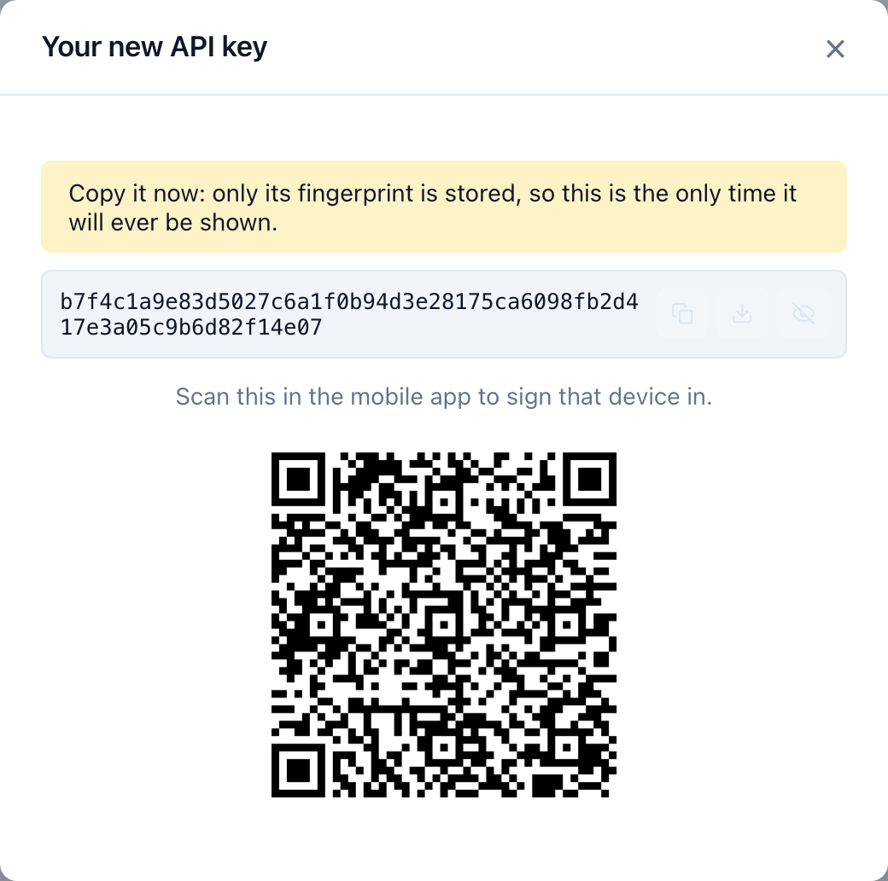

L'application mobile peut être connectée en **scannant un QR code** plutôt qu'en
tapant un e-mail et un mot de passe sur un clavier de téléphone. La même clé
configure aussi un script ou une future CLI.

## Ce qu'est une clé d'API

Un justificatif qui authentifie une requête avec un en-tête `X-Api-Key` plutôt
qu'avec une session. Elle porte **exactement vos droits** — ni plus, ni moins :
traitez-la comme votre mot de passe.

L'API n'en stocke que l'empreinte. La clé elle-même n'existe qu'une fois, dans
l'écran qui la crée, et ne peut plus être affichée ensuite. C'est délibéré : un
justificatif qu'un serveur peut relire est un justificatif qu'un serveur
compromis peut distribuer.

## En créer une

1. Connectez-vous sur le site.
2. Allez dans **Clés d'API** dans le menu.
3. Décrivez à quoi elle sert — « mon téléphone », « mon script d'export ». Vous
   vous remercierez quand vous en aurez trois.
4. Choisissez éventuellement une date d'expiration. Une clé sans expiration
   fonctionne jusqu'à sa révocation.
5. Choisissez **Créer**.


Une fenêtre s'ouvre avec la clé. **Elle ne reviendra pas.** Vous pouvez :

* la **copier**, pour la coller dans un script ;
* **télécharger le fichier de configuration**, un petit fichier texte qu'une CLI
  lit tel quel ;
* **afficher le QR code**, celui que l'application mobile scanne.



## Connecter l'application

1. Installez l'application Android : le lien de téléchargement et son propre QR
   code sont dans le menu, sous **Télécharger l'app Android**.
2. Ouvrez-la. Sur l'écran de connexion, choisissez **Se connecter en scannant un
   QR code**.
3. Autorisez la caméra quand elle est demandée.
4. Pointez-la vers le QR code affiché sur votre ordinateur.

L'application lit l'adresse du serveur et la clé dans le code, les vérifie
auprès de ce serveur, et n'enregistre la clé qu'une fois qu'il l'a acceptée. Un
code qui se scanne correctement mais désigne un serveur qui le refuse laisse
l'application exactement dans l'état où elle était.

## Ce que contient réellement le code

Deux lignes de texte — un QR code n'en est que le contenant :

```
api_url = https://api.strong-fish.com
api_key = <votre clé>
```

Le fichier de configuration téléchargeable a le même contenu : c'est pourquoi
une seule clé configure à la fois le téléphone et une CLI.

:::warning Quiconque le scanne devient vous
Le QR code est un justificatif affiché à l'écran. Ne le projetez pas, ne
l'envoyez pas en capture d'écran dans une conversation de groupe, et ne le
laissez pas ouvert sur une machine partagée. Si l'un d'eux fuite, révoquez cette
clé — **Clés d'API → Révoquer** — et elle cesse de fonctionner partout
immédiatement.
:::

## Révoquer

**Clés d'API** liste celles que vous avez, leur date d'expiration et un bouton
de révocation. Une clé révoquée cesse de fonctionner aussitôt, partout où elle
est utilisée. Se connecter avec un mot de passe sur un appareil enrôlé par QR
code remplace également sa clé.
