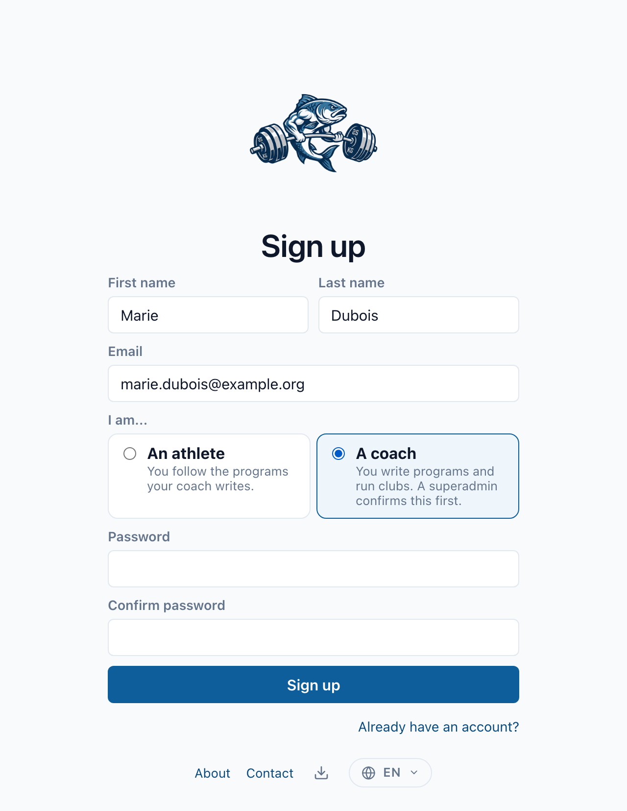

Tout le monde peut ouvrir un compte. La seule décision à prendre est **de quel
type**.

## Athlète ou coach

À l'inscription, vous choisissez l'un des deux :

* **Je suis un athlète.** Vous suivez les programmes qu'un coach écrit pour
  vous, vous notez vos séries et vous publiez dans le fil de vos clubs. C'est le
  choix par défaut, et celui de la plupart des comptes.
* **Je suis un coach.** En plus de tout ce que peut faire un athlète, vous créez
  des clubs, écrivez et importez des programmes, les assignez à vos membres et
  enrichissez le catalogue d'exercices partagé.

## S'inscrire en tant qu'athlète

1. Ouvrez [strong-fish.com](https://strong-fish.com) et choisissez
   **S'inscrire**.
2. Renseignez vos nom, prénom, e-mail et un mot de passe.
3. Laissez **Je suis un athlète** sélectionné.
4. Confirmez votre adresse depuis l'e-mail que vous recevez.

C'est tout. Vous êtes dedans.

Personne n'a à vous approuver, et vous n'avez pas besoin d'un club pour
commencer : enregistrez vos maxima dans **Mes 1RM** et l'application est déjà
utile. Un club, c'est ce qui vous relie à un coach.

## S'inscrire en tant que coach

Les quatre premières étapes sont identiques : choisissez **Je suis un coach** à
l'étape 3.

Ce qui change, c'est la suite :

1. Votre compte est créé **en tant qu'athlète**, et fonctionne immédiatement
   comme tel.
2. Une demande est mise en file pour un superadmin, et tous les superadmins sont
   prévenus par e-mail.
3. Lorsqu'ils la confirment, votre compte devient coach et vous êtes prévenu.
   L'écran **Clubs** gagne un bouton de création, et **Exercices** devient
   modifiable.
4. S'ils la refusent, vous recevez le motif par e-mail. Votre compte continue de
   fonctionner en tant qu'athlète.

:::info Pourquoi cette attente
Choisir « coach » enregistre une déclaration, pas une autorisation. Un coach
écrit l'entraînement des autres et voit les retours qu'ils notent :
l'application ne prend donc pas cette déclaration pour argent comptant,
quelqu'un la confirme d'abord.
:::

### Pendant l'attente

Rien n'est bloqué. Notez vos maxima, rejoignez un club où vous avez été invité,
publiez dans le fil. Quand la confirmation arrive, tout ce que vous avez fait en
tant qu'athlète est toujours là : c'est le même compte, avec plus de
possibilités.

## Les badges de votre profil

Votre profil en porte deux, côte à côte sous votre nom, chacun de sa couleur.

**Ce que vous êtes ici** d'abord : *athlète*, *coach* ou *superadmin*. Celui-là
ne se choisit pas - il suit votre compte, et change tout seul le jour où une
demande de coach est confirmée.

**Ce que vous soulevez** ensuite, et celui-là vous appartient :

Vos badges sont déduits des maxima que vous enregistrez, pas choisis dans une
liste :

| Badge | Pour |
| --- | --- |
| Recrue de fonte … Titan | votre niveau, d'après votre score DOTS |
| Squat à 2x le poids de corps, développé à 1,5x, soulevé à 2,5x | ce que vous soulevez rapporté à ce que vous pesez |
| Club des 500 kg, des 1000 lb, des 1500 lb | les totaux repères |
| Club des 300 / 400 / 500 DOTS | les paliers de coefficient |
| Spécialiste du squat, du soulevé de terre, Survivant du développé pauvre | la forme de vos trois mouvements |

Ils apparaissent sur votre profil dès que votre poids de corps et vos trois
maxima sont enregistrés, et le calculateur de force montre ce que vaudrait
n'importe quel total avant d'y arriver. Rien à choisir et rien à tenir à jour :
les badges suivent les chiffres.

## Rejoindre un club

Deux entrées possibles, et ce sont deux gestes différents :

* **Un coach vous ajoute.** Vous êtes simplement dans le club, et vous recevez
  un e-mail vous le disant.
* **Un coach vous invite.** L'invitation vous attend dans **Invitations**
  jusqu'à ce que vous l'acceptiez ou la refusiez. Elle arrive aussi par e-mail.

Une invitation est adressée à votre **adresse e-mail**, pas à votre compte : un
coach peut donc vous inviter avant même votre inscription. Créez le compte avec
cette même adresse et l'invitation vous attendra dès votre première visite.

## Ensuite

* [RPE, 1RM et e1RM](../vocabulary.md) — ce que veulent dire les nombres de
  votre programme.
* [Se connecter avec une clé d'API](./api-key-login.md) — installer
  l'application sur votre téléphone sans taper de mot de passe.
