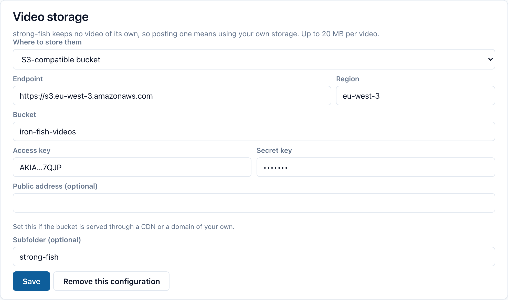
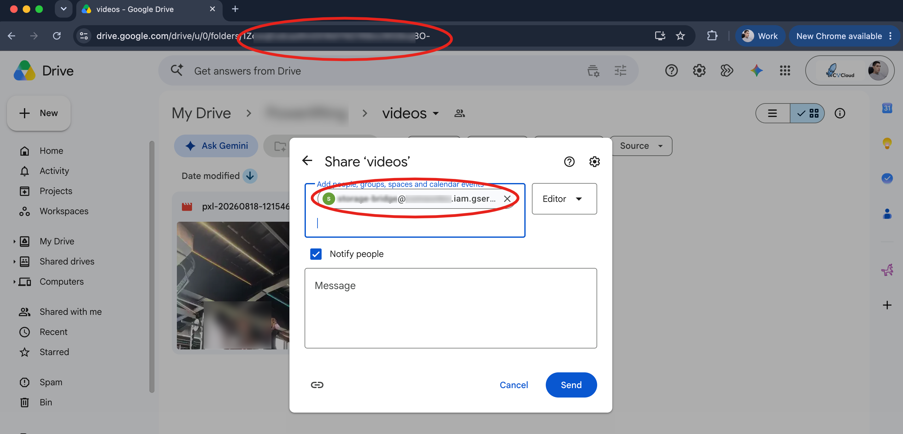

Les liens vidéo de YouTube, Vimeo et consorts se lisent tout seuls dans le fil :
collez-en un dans une publication et le lecteur apparaît. Vous pouvez aussi
joindre directement un fichier vidéo — une tentative en compétition, une
vérification technique —, en envoyer un en message privé, ou enregistrer un
message vocal dans une conversation. Ces trois-là partent dans **votre propre
stockage**, pas dans le nôtre.

## Pourquoi votre propre bucket

StrongFish n'héberge ni vidéo ni audio, parce que nous voulons rester gratuits et open source — et cela implique d'accepter certains compromis pour réduire les coûts.

Vous pouvez donc configurer donc une destination : un **bucket compatible S3** ou un **dossier Google Drive**. L'application y dépose le fichier et la publication porte un lien vers lui. Tant que vous n'en avez pas configuré, les boutons vidéo et microphone
répondent « configurez d'abord votre stockage » — l'API renvoie un 405, c'est-à-dire que la requête était correcte mais que la fonctionnalité n'est pas
encore disponible sur votre compte.

Configurez-le une fois et il couvre les trois usages : vidéos dans les publications, vidéos dans les messages, et messages vocaux.

## Option 1 : un bucket compatible S3

Fonctionne avec AWS S3, MinIO, Scaleway, DigitalOcean Spaces — tout ce qui est compatible avec l'API S3 (object storage).

1. Créez un bucket, et une clé d'accès autorisée à y écrire.
2. **Les objets doivent être lisibles publiquement.** Le lien part dans une publication et est lu par un lecteur vidéo dans le navigateur de quelqu'un d'autre, sans aucun justificatif. StrongFish dépose chaque objet avec une ACL `public-read` ; un bucket dont les ACL sont désactivées refusera l'envoi, et c'est le bon moment pour s'en apercevoir.
3. Dans l'application : **Paramètres → Stockage des vidéos**, choisissez *Bucket compatible S3*.
4. Renseignez :

| Champ | Exemple |
| --- | --- |
| Endpoint | `https://s3.eu-west-3.amazonaws.com` |
| Région | `eu-west-3` |
| Bucket | `mes-videos-powerlifting` |
| Clé d'accès / Clé secrète | fournies par votre hébergeur |
| Sous-dossier *(facultatif)* | `strong-fish` |
| Adresse publique *(facultatif)* | votre CDN ou domaine personnalisé, si le bucket est servi par l'un des deux |

5. Enregistrez.

## Option 2 : un dossier Google Drive

1. Dans la console Google Cloud, créez un [**compte de service**](https://docs.cloud.google.com/iam/docs/service-account-overview) et téléchargez sa **clé JSON**.
2. Créez (ou choisissez) un dossier Drive, et **partagez-le avec l'adresse e-mail du compte de service** en droits d'écriture. Sans cela il ne pourra rien y écrire — c'est l'étape que tout le monde oublie.
3. Copiez l'identifiant du dossier : c'est la dernière partie de son URL, `https://drive.google.com/drive/folders/<cette partie>`.
4. Dans l'application : **Paramètres → Stockage des vidéos**, choisissez *Dossier Google Drive*.
5. Téléversez le fichier de clé JSON et collez l'identifiant du dossier.
6. Indiquez éventuellement un **sous-dossier** — `strong-fish/videos`, par exemple. Il est créé dans le dossier partagé s'il n'existe pas encore : vous n'avez pas à le créer à la main. Laissez vide pour écrire directement dans le dossier.
7. Enregistrez.

StrongFish accorde à chaque fichier déposé un accès en lecture « toute personne disposant du lien » au moment de l'écriture, et publie le lecteur Drive.

## Publier une vidéo

1. Allez dans le fil et commencez une publication.
2. Choisissez **Ajouter une vidéo** et sélectionnez un fichier — MP4, WebM ou MOV, jusqu'à 20 Mo par défaut.
3. L'URL du fichier déposé est ajoutée au texte de votre publication.
4. Écrivez ce que vous voulez autour, et publiez.

Le lecteur apparaît automatiquement. Il n'y a pas de champ « lien » séparé : **la première URL d'une publication est son média**, que vous l'ayez déposée ou collée depuis YouTube.

Cela fonctionne de la même façon dans l'**application mobile** : l'icône caméra sous le champ de saisie prend une vidéo depuis votre téléphone.

## Envoyer une vidéo en message

Une conversation privée dispose des mêmes boutons : une image, une vidéo et un microphone. Une vidéo envoyée ainsi est déposée exactement comme celle d'une publication et ajoutée au message sous forme de lien, pour se lire dans la conversation.

## Enregistrer un message vocal

Appuyez sur le **microphone** dans une conversation pour démarrer l'enregistrement, et appuyez à nouveau pour l'arrêter. 

L'enregistrement est déposé à l'arrêt, pas au moment de l'envoi : le message part donc dès que vous appuyez sur envoyer.

L'application web comme le téléphone savent enregistrer. 
Sur téléphone, Android demande l'autorisation d'utiliser le microphone la première fois.

Un message vocal stocké sur **Google Drive** se lit dans le lecteur de Drive plutôt que dans une barre audio ordinaire — Drive sert une page d'aperçu pour un fichier, et non le fichier lui-même. Rien à configurer ; c'est bon à savoir pour que la différence entre les messages de deux membres ne ressemble pas à un bug.

## En cas de problème

| Ce que vous voyez | Ce que c'est généralement |
| --- | --- |
| « Configurez votre propre stockage vidéo » | Aucun stockage configuré. Le même message vaut pour les vidéos et les messages vocaux. |
| « Votre stockage a refusé cet envoi » | Mauvaises clés, mauvais nom de bucket, ou ACL désactivées. |
| « Cette vidéo est trop volumineuse » | Au-delà de la limite — l'écran de stockage vous indique laquelle. |
| « Pas une vidéo lisible par un navigateur » | Réencodez en MP4 (H.264). |
| La publication affiche une carte de lien, pas un lecteur | L'URL du fichier n'est pas publiquement lisible. Vérifiez la politique du bucket, ou le partage du dossier Drive. |
| Le bouton microphone ne fait rien sur le téléphone | L'autorisation d'enregistrer a été refusée. Accordez-la dans les paramètres de l'application sous Android. |
